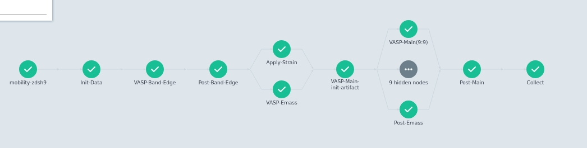

# 1. mobility_2d_workflow 
workflow to calculate mobility of 2D or 1D materials
# 2. Prerequisites
## 2.1 Local machine

a python3 env with numpy, pandas, pydflow, pymatgen installed

docker and k8s: https://github.com/deepmodeling/dflow/blob/master/tutorials/readme.md

## 2.2 Remote cluster
slurm system

similar python env with numpy, pandas, pydflow, pymatgen

vasp with compitable mpirun, vaspkit

# 3 Usage
main python script `mobility_calc.py` and data processing functions i`post_process.py`

put these two python script at same path, as well as a "mobility" directorywhich contains relaxed POSCAR of 2D insulators/semiconductors, POTCAR, and a scf INCAR.

The INCAR file should contains the LVHAR=T to get the LOCPOT.

run `python mobility_calc.py` with docker-group user(linux) or admin user(windows) and wait for results.

# 4 workflow detail
Ref: https://doi.org/10.1038/ncomms5475.

2D elastic constants, C2D

deformation potential constant, DPC

effective mass, m*



## 4.1 VASP band edge
Generate 2D high symmetry k-path KPOINTS_OPT (vasp >= 6.3.0) by vaspkit

Run vasp to calculate band edge location

## 4.2 Post process band edge
create kopt_emass for emass calculation

create kopt_edge for DPC calculation

## 4.3 Apply Strain + Emass
Both of these two steps depend on band edge location

We can obtain C2D and DPC from Strained structures.

## 4.4 Main vasp run for strained structures + postprocess emass

## 4.5 Collect results

# 5 etc
for linux user, add your work user to docker group.

```
# this works for ldap remote user, better than usermod of CentOS7
gpasswd -a liulp docker
```

for windows user, please run all kube related command in a administrative powershell/cmd
```bash
# run `netsh winsock reset`, and do not reboot, in case of network problem
conda activate dflow # mamba activate is bad in powershell
minikube start --image-mirror-country=cn
kubectl create ns argo
kubectl apply -n argo -f https://raw.githubusercontent.com/deepmodeling/dflow/master/manifests/quick-start-postgres-3.4.1-deepmodeling.yaml
kubectl -n argo port-forward deployment/argo-server 2746:2746 --address 0.0.0.0
kubectl -n argo port-forward deployment/minio 9000:9000 --address 0.0.0.0
```
